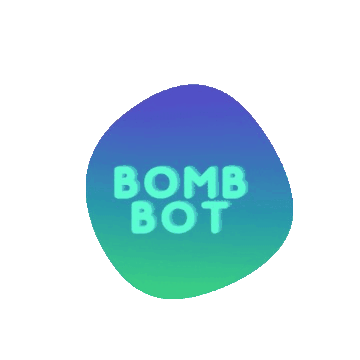

<h1 align="center"> Bomb! Bot </h1>

## 🚧 Dụng cụ cần thiết 

- [Node.js 14+](https://nodejs.org/en/download/)
- [discord.js@12.5.3](https://www.npmjs.com/package/discord.js/v/12.5.3)
- [Lavalink Server](https://github.com/freyacodes/Lavalink#server-configuration)

> NOTE: Cần 1 server Lavalink để bot chạy hiệu quả.

## 📝 Hướng dẫn:

Lười viết lắm, có khi để khi nào viết riêng cho Bomb!
Dưới đây là hướng dẫn chung cho Discord-MusicBot, bấm vào hình để xem nhé:

## 💨 Chạy bot?

Vứt giùm lên VPS. Lưu ý cấu hình tối thiểu là 1 vCPU 1Ghz và 1GB RAM. Để quản lý bot tốt hơn, nhớ cài thêm aaPanel

## ✨ Đóng góp

Dưới đây là các Cộng tác viên đã đóng góp cho Discord-MusicBot, tiền thân của Bomb! Bot. Nhờ họ mà code chạy mượt mà.
Vui lòng không đóng góp vào Repo này, hãy đóng góp cho Repo chính của tác giả nhé!

